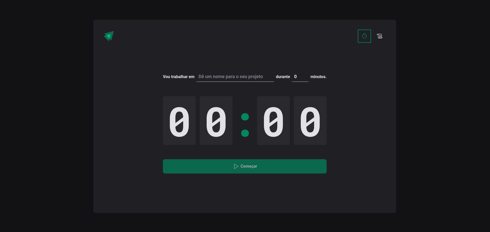

# Ignite Timer!

<h1 align="center">
  
</h1>

> Aplicação desenvolvida para gerenciamento de tempo de execução de tarefas, com suporte da aula prática da plataforma Rocketseat. Foco da aprendizagem: Hooks como useReducer e useContext. 

## 💻 Pré-requisitos

Antes de começar, verifique se você atendeu aos seguintes requisitos:
* Você tem uma máquina `<Windows / Linux / Mac>`.
* Você tem o [git](https://git-scm.com) instalado na sua máquina.
* Você tem o [node](https://nodejs.org/en/) instalado na sua máquina.

## 🚀 Instalando Ignite Timer

Para instalar o Ignite Timer, siga estas etapas:

bash:
```
# Clone este repositório
$ git clone <https://github.com/vitorrdc/igniteTimer>
# Acesse a pasta do projeto no terminal/cmd
$ cd igniteTimer
# Instale as dependências
$ npm install ou yarn install
```

## ☕ Usando Ignite Timer

Para usar igniteTimer, siga estas etapas:

bash:
```
# Acesse a pasta do projeto no terminal/cmd
$ cd igniteTimer
# Execute a aplicação em modo de desenvolvimento
$ npm start ou yarn start
# O servidor inciará na porta:5173
# Agora é só acessar o endereço http://localhost:5173 no Browser de sua preferência
```

### 🛠 Tecnologias

As seguintes ferramentas foram usadas na construção do projeto:
- [React](https://reactjs.org/)
- [Typescript](https://www.typescriptlang.org/)
- [Zod](https://zod.dev/)
- [React Hook Form](https://react-hook-form.com/)
- [Styled Components](https://styled-components.com/)
- [Immer](https://github.com/immerjs/immer)

  
### 👨🏾‍💻 Autor
---

 

Feito com ❤️ por Vitor Ribeiro 👋🏽 Entre em contato!


[](mailto:vitor.camposrdc@gmail.com)
